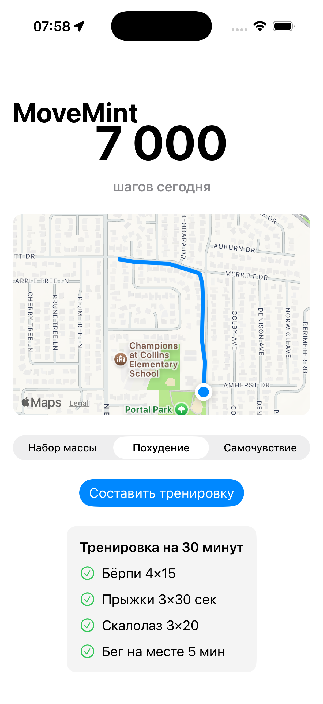
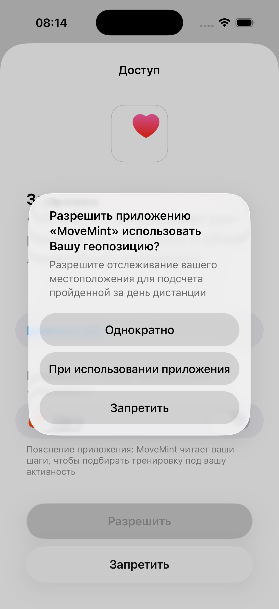
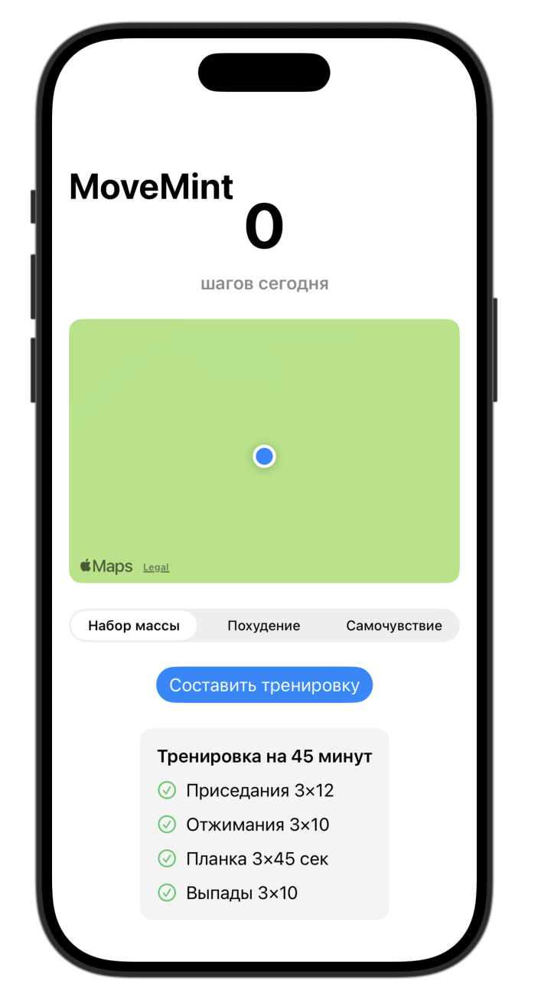

# MoveMint 🏃‍♀️🍃

A fitness app that reads your daily steps from HealthKit, maps your route, and generates a personalized workout — with duration and exercises adapted to how active you've already been today.

The more you've walked, the shorter your workout. The less you've moved, the longer it is. Simple idea, built on Clean Architecture with full test coverage.

## Screenshots

| Dashboard & Route | HealthKit Permission | Generated Workout |
|---|---|---|
|  |  |  |

## Features

- 📊 **Daily steps from HealthKit** — reads today's step count directly from the Health app
- 🗺️ **Route tracking on the map** — your movement today, drawn live on MapKit as you go
- 🎯 **Three fitness goals** — Muscle Gain, Weight Loss, Wellbeing — each with a different exercise style
- 🤖 **AI-generated workouts** — exercises tailored to your goal and available duration
- ⏱️ **Adaptive duration** — walked a lot already? Shorter workout. Barely moved? Longer one.
- ♿️ **Accessibility support** — VoiceOver labels, grouped elements, Dynamic Type–aware layout

## How duration is calculated

```
≥ 8000 steps  →  15 min workout
4000–7999     →  30 min workout
< 4000 steps  →  45 min workout
```

Pure function, fully unit tested — see `WorkoutPlannerTests`.

## Architecture

Clean Architecture, three layers, dependencies point inward:

```
Presenters (SwiftUI Views + ViewModels)
        │
        ▼
Domain (protocols, models, use cases — no framework imports)
        ▲
        │
Data (HealthKit, MapKit/CoreLocation, Claude API — implements Domain protocols)
```

- **Domain** knows nothing about HealthKit, MapKit, or networking — only protocols and pure logic (`WorkoutPlanner`, `GenerateWorkoutUseCase`).
- **Data** implements those protocols (`HealthService`, `LocationService`, `AIWorkoutService` / `MockAIWorkoutService`).
- **Presenters** depend only on Domain, via a `DependencyFactory` composition root.

This means the core logic (steps → duration, goal → workout) is testable without touching HealthKit, GPS, or the network at all.

## AI integration

Workouts are generated through `AIWorkoutServiceProtocol`. Two implementations are wired up in `DependencyFactory`:

- **`MockAIWorkoutService`** (default) — returns curated exercises per goal, no API key or network required. The app is fully functional out of the box.
- **`AIWorkoutService`** — calls the Claude API. To use it, add your key to `Secrets.swift` (git-ignored, not included in this repo) and switch the implementation in `DependencyFactory`.

## Tech stack

- Swift, SwiftUI
- HealthKit — step count via `HKStatisticsQuery`
- MapKit + CoreLocation — live route polyline via delegate-based location updates
- Swift Testing (`@Test`, `#expect`) — 9 unit tests
- Clean Architecture with protocol-based dependency injection

## Testing

```
WorkoutPlannerTests          — 6 tests: duration boundaries (0, 4000, 8000 steps, etc.)
GenerateWorkoutUseCaseTests  — 3 tests: orchestration via stubbed HealthService + AIWorkoutService
```

Run with `⌘U` in Xcode.

## Setup

1. Clone the repo
2. Open `MoveMint.xcodeproj` in Xcode
3. Build and run — works immediately with the mock AI service
4. (Optional) To use real AI-generated workouts, create `Secrets.swift` with your Claude API key and set `aiService` to `AIWorkoutService()` in `DependencyFactory`

No HealthKit data in the simulator? Add sample steps manually via the **Health** app on the simulator (Browse → Steps → Add Data).

## License

MIT
